\newpage

# 1 Worum es geht

Ein Transistor wird in der Vorlesung zuerst als Kennfeld gezeigt und danach als Vierpol
gerechnet. Zwischen beidem klafft eine Lücke: das Kennfeld steht im Datenblatt, die
Vierpolparameter stehen in der Formelsammlung, und wie das eine aus dem anderen folgt,
bleibt meist eine Behauptung. Dieses Manuskript schließt die Lücke an einem einzigen
Bauteil und auf einem Weg, der sich von Hand nachrechnen lässt:

1. Ein selbstgebauter Messplatz nimmt das Kennfeld auf. Er besteht aus einem
   Mikrorechner, einem 16-Bit-Analog-Digital-Umsetzer, einem 16-Bit-Digital-Analog-Umsetzer,
   zwei Treiberverstärkern und drei gesteckten Widerständen. Geregelt wird in Kaskade:
   der äußere Kreis stellt den Basisstrom, der innere die Kollektor-Emitter-Spannung.
2. Aus dem gemessenen Kennfeld werden die Parameter eines Transistormodells bestimmt —
   erst merkmalsweise mit Bleistift und Papier, dann als Gesamtausgleich über alle Kurven,
   und zuletzt wird geprüft, welcher Parameter aus diesen Daten überhaupt bestimmbar ist.
3. Aus dem angepassten Modell werden die h-Parameter im Arbeitspunkt als Ableitungen
   gewonnen, daraus die Kettenmatrix (A-Parameter), und damit wird eine vollständige
   Emitterschaltung durchgerechnet.

Der Weg ist bewusst so gelegt, dass an keiner Stelle ein Baustein als Orakel auftritt.
Jede Zahl in diesem Manuskript ist entweder gemessen oder aus gemessenen Zahlen
gerechnet; die Rechenprogramme liegen bei und sind gelaufen.

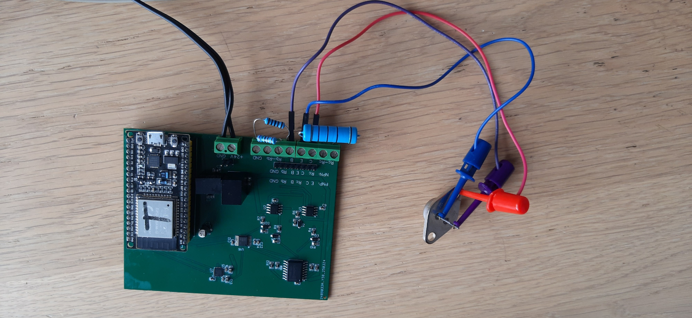{width=100%}

\newpage

# 2 Der Messplatz

## 2.1 Übersichtsplan

Der Aufbau folgt einer einfachen Idee: zwei Spannungsquellen speisen den Prüfling über
je einen Messwiderstand, und vier Spannungen werden gemessen. Ströme werden nicht mit
Stromwandlern erfasst, sondern als Spannungsabfall über bekannten Widerständen gerechnet.
Damit kommt der ganze Messplatz mit einem einzigen vierkanaligen Spannungsmesser aus.

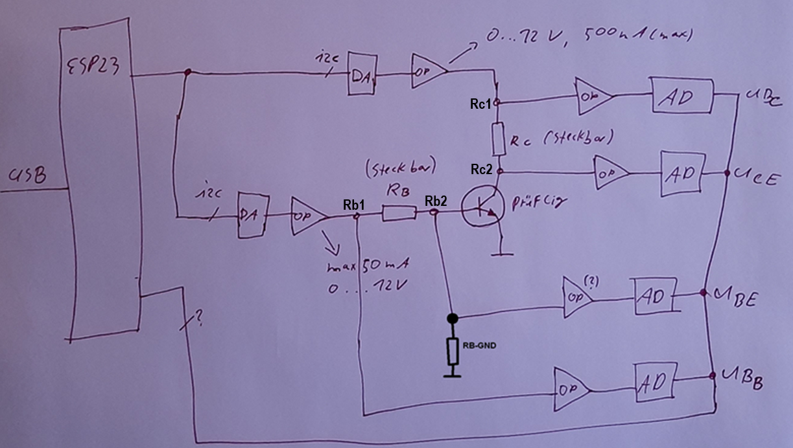{width=100%}

Die Bezeichnungen des Plans werden im ganzen Manuskript und in der Firmware verwendet:

| Knoten | Bedeutung |
|:--|:--|
| $U_{RC1}$ | Speisepunkt des Kollektorzweigs, vor dem Messwiderstand $R_C$ |
| $U_{RC2}$ | Kollektor des Prüflings, hinter $R_C$; zugleich $U_{CE}$ (Emitter liegt an Masse) |
| $U_{RB1}$ | Speisepunkt des Basiszweigs, vor dem Messwiderstand $R_B$ |
| $U_{RB2}$ | Basis des Prüflings, hinter $R_B$; zugleich $U_{BE}$ |

Alle Ströme und Spannungen sind positiv. Der Messplatz arbeitet im ersten Quadranten
des npn-Transistors; für pnp-Prüflinge ist auf der Leiterplatte eine zweite
Klemmenreihe vorgesehen.

## 2.2 Der Ausgabeweg: Umsetzer und Treiber

Der Digital-Analog-Umsetzer ist ein DAC8565 mit vier Kanälen zu je 16 Bit, angesteuert
über SPI. Zwei Kanäle sind belegt: Kanal A liefert die Steuerspannung des Kollektorzweigs
($U_{C}$), Kanal B die des Basiszweigs ($U_{B}$). Der Ausgangsbereich ist 0 … 2,5 V.

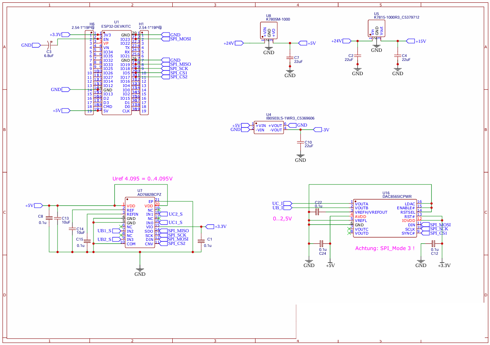{width=100%}

Weil ein Transistor mehr Spannung und deutlich mehr Strom braucht, als ein Umsetzer
liefern kann, folgt je Kanal ein nichtinvertierender Verstärker (Doppel-Leistungs-Operations\-verstärker
TCA0372). Seine Verstärkung folgt aus dem Rückführteiler:

$$v = 1 + \frac{R_{11}}{R_{1}} = 1 + \frac{22\,\text{k}\Omega}{5{,}6\,\text{k}\Omega} = 4{,}92857$$

Im Kollektorzweig liegt zusätzlich ein Längstransistor (2SC3519) innerhalb der
Gegenkopplung; er erhöht nur den lieferbaren Strom, nicht die Verstärkung, weil die
Rückführung hinter ihm abgegriffen wird ($R_{12}/R_3$, gleiche Werte).

Damit gilt für beide Speisepunkte dieselbe Umrechnung von Registerwert zu Klemmenspannung.
Mit $U_{\mathrm{ref,DA}} = 2{,}5$ V und $2^{16}$ Stufen:

$$k_{DA} = \frac{U_{\mathrm{ref,DA}}}{2^{16}}\cdot v
        = \frac{2{,}5\ \text{V}}{65536}\cdot 4{,}92857
        = 188{,}010\ \mu\text{V je Schritt}$$

Der größte Registerwert ist 65535; daraus folgt

$$U_{RB1,\max} = 65535 \cdot 188{,}010\ \mu\text{V} = 12{,}3212\ \text{V}.$$

Das deckt sich mit der Angabe „0 … 12 V" im handgezeichneten Übersichtsplan.

## 2.3 Der Messweg: Folger, Teiler, Umsetzer

Jede der vier Knotenspannungen wird zuerst von einem Spannungsfolger abgegriffen
(LTA8092, unbelastender Eingang), dann durch einen Teiler auf den Eingangsbereich des
Analog-Digital-Umsetzers gebracht und von einer Z-Diode gegen Überspannung geschützt.

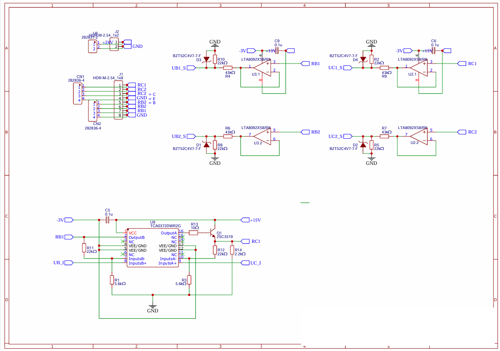{width=100%}

Der Teiler ist

$$t = \frac{R_{10}}{R_4 + R_{10}} = \frac{22\,\text{k}\Omega}{43\,\text{k}\Omega + 22\,\text{k}\Omega}
    = \frac{22}{65} = 0{,}338462 .$$

Die Reihenfolge ist wichtig: erst der Folger, dann der Teiler. Stünde der Teiler vorn,
belastete er den Messknoten mit 65 k$\Omega$ — im Basiszweig, wo Ströme von wenigen
Mikroampere gemessen werden, wäre das ein grober Fehler.

Der Umsetzer AD7682 hat vier Kanäle zu 16 Bit. Seine Referenz folgt aus dem
Konfigurationswort der Firmware (`ad_da.cpp`):

```
#define AD_MODE (0x2000 | 0x1C00 | 0x0008 | 0x0001) << 2
```

Darin bedeutet `0x2000` „Konfiguration übernehmen", `0x1C00` den unipolaren Eingang
gegen Masse, `0x0008` die interne Referenz von 4,096 V, `0x0001` „Konfiguration nicht
zurücklesen"; das nicht gesetzte Bit 6 wählt die kleine Bandbreite (stärkere Glättung),
die nicht gesetzten Bits 2 und 1 schalten den Kanalfolger ab. Der Schiebevorgang um
zwei Stellen setzt das 14-Bit-Wort in den 16-Bit-Rahmen.

Damit ist die Umrechnung von Registerwert zu Klemmenspannung

$$k_{AD} = \frac{U_{\mathrm{ref,AD}}}{2^{16}}\cdot\frac{1}{t}
        = \frac{4{,}096\ \text{V}}{65536}\cdot\frac{65}{22}
        = 62{,}5\ \mu\text{V}\cdot 2{,}95455
        = 184{,}659\ \mu\text{V je Schritt},$$

und die größte messbare Klemmenspannung ist $65535 \cdot 184{,}659\ \mu\text{V} = 12{,}1016$ V.
Sie liegt bewusst etwas unter dem, was der Treiber liefern kann: der Messweg soll nicht
vor dem Stellweg an seine Grenze kommen.

## 2.4 Die Mittelwertbildung

Jeder Kanal wird bei jedem Durchlauf der Hauptschleife einmal gewandelt und in einen
Ringspeicher der Länge $N = 10$ geschrieben; der Mittelwert daraus steht in einem
eigenen Register. Die Firmware rechnet ganzzahlig:

$$\overline{x} = \left\lfloor \frac{1}{N}\sum_{k=0}^{N-1} x_k \right\rfloor .$$

Die Abschneidung kostet höchstens einen Zählschritt, also 185 $\mu$V an der Klemme —
weniger als das Rauschen des Aufbaus. Der Gewinn ist der übliche: unkorreliertes
Rauschen wird um $\sqrt{N} = 3{,}16$ kleiner.

## 2.5 Die gesteckten Widerstände

Drei Widerstände sind gesteckt und bestimmen die Messbereiche:

* $R_C$ im Kollektorzweig — legt den Strommessbereich und den Spannungsabfall fest,
* $R_B$ im Basiszweig — dasselbe für den Basisstrom,
* $R_{B\_GND}$ von der Basis nach Masse — ein Ableitwiderstand, der den Basisknoten
  auch bei gesperrtem Transistor definiert hält.

Die verwendeten Werte sind in den Unterlagen nicht vermerkt. Sie lassen sich aber aus
den Anzeigewerten der Bedienblätter zurückrechnen, weil dort die Spannungen und die
daraus gebildeten Ströme nebeneinander stehen. Aus dem Blatt des ersten Quadranten:

$$R_B = \frac{U_{RB1}-U_{RB2}}{I_{RB}} = \frac{0{,}482\ \text{V} - 0{,}056\ \text{V}}{0{,}0570\ \text{mA}} = 7473{,}7\ \Omega$$

$$R_{B\_GND} = \frac{U_{RB2}}{I_{R\_GNB}} = \frac{0{,}056\ \text{V}}{0{,}0554\ \text{mA}} = 1010{,}8\ \Omega$$

Das Blatt des dritten Quadranten ist dabei das aussagekräftigste, weil es mit dem
Zwanzigfachen des Basisstroms arbeitet und die Rundung der Anzeige dort entsprechend
weniger wiegt:

$$R_B = \frac{10{,}611\ \text{V} - 0{,}575\ \text{V}}{1{,}3405\ \text{mA}} = 7486{,}8\ \Omega,
\qquad R_{B\_GND} = \frac{0{,}575\ \text{V}}{0{,}5717\ \text{mA}} = 1005{,}8\ \Omega$$

Über alle vier vorliegenden Blätter gemittelt ergibt sich $R_B = 7485\ \Omega$ und
$R_{B\_GND} = 1005\ \Omega$; die Anzeige hat nur drei Nachkommastellen, die Streuung
von etwa 0,4 % ist genau die Rundung — und dass das Blatt mit dem zwanzigfachen Strom
denselben Wert liefert, ist die Bestätigung. Die nächsten Werte der Reihe E24 sind
$R_B = 7{,}5$ k$\Omega$ und $R_{B\_GND} = 1$ k$\Omega$ — beides sind übliche Werte, und
mehr als „der Bestückung nach plausibel" ist damit nicht behauptet. $R_C$ lässt sich so
nicht zurückrechnen, weil auf allen vorliegenden Blättern $U_{RC1} = U_{RC2}$ und damit
$I_C = 0$ angezeigt wird; $R_C$ bleibt deshalb eine Eingabe.

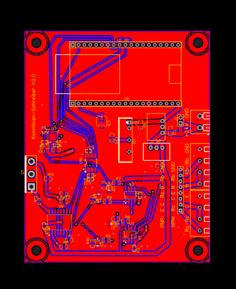{width=70%}

## 2.6 Der Registerplan

Der Mikrorechner ist nach außen ein gewöhnlicher Modbus-RTU-Teilnehmer mit der
Adresse 1 an der seriellen Schnittstelle (115200 Bit/s, 8N1). Er hält 13 Register:

| Register | Name in der Firmware | Inhalt | Schreiben? |
|:--:|:--|:--|:--:|
| 0 | `REG_DA0+0` | Stellwert Kollektorzweig $U_C$ (Kanal A) | ja |
| 1 | `REG_DA0+1` | Stellwert Basiszweig $U_B$ (Kanal B) | ja |
| 2, 3 | `REG_DA0+2,3` | nicht belegt | ja |
| 4 | `REG_AD0+0` | Messwert $U_{RC1}$, roh | nein |
| 5 | `REG_AD0+1` | Messwert $U_{RC2} = U_{CE}$, roh | nein |
| 6 | `REG_AD0+2` | Messwert $U_{RB1}$, roh | nein |
| 7 | `REG_AD0+3` | Messwert $U_{RB2} = U_{BE}$, roh | nein |
| 8 … 11 | `REG_ADMIW+0…3` | dieselben vier Werte als Mittelwert über $N = 10$ | nein |
| 12 | — | frei | nein |

Dass die Messregister nicht beschreibbar sind, steht nicht im Handbuch, sondern in einer
einzigen Zeile der Firmware:

```c
void setReg(uint16_t aReg, uint16_t aWert){
  if ((aReg<REG_AD0) && (reg[aReg]!=aWert)){
    reg[aReg]=aWert;
  }
}
```

Ein Schreibbefehl auf Register 4 und höher wird quittiert, aber nicht ausgeführt. Das ist
kein Mangel, sondern die einzige Stelle, an der ein fehlerhaft eingerichteter Leitstand
sich selbst Messwerte vorschreiben könnte.

Unterstützt werden die Funktionscodes 1, 2 (Bitleser, liefern Null), 3 und 4 (Register
lesen), 5, 6, 15, 16 (schreiben) sowie 8 (Diagnose-Echo). Das Telegrammende erkennt die
Firmware nicht an der Sendepause, sondern an der Sollänge, die aus dem Funktionscode
folgt; ist die Prüfsumme falsch, wird ein Byte verworfen und erneut aufgesetzt.

\newpage

# 3 Die Kaskadenregelung

## 3.1 Warum überhaupt geregelt wird

Eine Kennlinie ist eine Aussage über einen eingestellten Zustand: „bei $I_B = 24\ \mu$A
und $U_{CE} = 5$ V fließt $I_C = \ldots$". Beide Größen lassen sich aber nicht direkt
stellen. Gestellt werden zwei Spannungen an den Speisepunkten; was daraus wird, hängt
vom Prüfling ab. Zwei Beispiele:

* Erhöht man $U_{RB1}$, so steigt $I_B$ — aber nicht proportional, denn der
  Basis-Emitter-Übergang ist eine Diode, und ein Teil des Stroms fließt durch
  $R_{B\_GND}$ ab.
* Erhöht man $U_{RC1}$, so steigt $U_{CE}$ — aber der gleichzeitig steigende
  Kollektorstrom vergrößert den Abfall über $R_C$ und nimmt einen Teil davon wieder weg.

Die beiden Wirkungen sind außerdem verkoppelt: $I_C$ hängt von $U_{BE}$ ab, und $I_B$
hängt (schwach) von $U_{CE}$ ab. Deshalb wird in Kaskade geregelt.

## 3.2 Die beiden Kreise

**Äußerer Kreis — Basisstrom.** Der Basisstrom wird nicht gemessen, sondern aus zwei
Spannungen gerechnet. Am Knoten $R_{B2}$ (der Basis) gilt die Knotengleichung: was durch
$R_B$ zufließt, teilt sich auf in den Ableitstrom durch $R_{B\_GND}$ und den Basisstrom.

$$\underbrace{\frac{U_{RB1}-U_{RB2}}{R_B}}_{\text{Zufluss}}
 = \underbrace{\frac{U_{RB2}}{R_{B\_GND}}}_{\text{Ableitung}} + I_B$$

$$\boxed{\;I_B = \frac{U_{RB1}-U_{RB2}}{R_B} - \frac{U_{RB2}}{R_{B\_GND}}\;}\qquad\text{(I)}$$

Stellglied ist der Digital-Analog-Kanal B (in der Bedienoberfläche „DA2").

**Innerer Kreis — Kollektor-Emitter-Spannung.** Hier ist die Messung unmittelbar,
weil der Emitter an Masse liegt:

$$\boxed{\;U_{CE} = U_{RC2}\;}$$

Stellglied ist der Digital-Analog-Kanal A („DA1").

**Die Messgröße.** Erst wenn beide Kreise eingeschwungen sind, wird der Kollektorstrom
aus dem Abfall über $R_C$ gerechnet:

$$\boxed{\;I_C = \frac{U_{RC1}-U_{RC2}}{R_C}\;}$$

Dass der innere Kreis der schnellere sein muss, ist die Grundregel jeder Kaskade: der
äußere Kreis darf erst dann nachstellen, wenn der innere seine Störung schon
ausgeregelt hat. Verletzt man sie, schaukeln sich beide gegeneinander auf.

**Wie schnell der innere Kreis sein darf**, ist ebenfalls nachrechenbar, und die Antwort
steckt in der Mittelwertbildung. Der Regler ist ein Integrierer — er addiert bei jedem
Durchlauf ein Stück auf den Stellwert —, und er sieht nicht den Istwert, sondern dessen
Mittelwert über $N = 10$ Abtastungen. Ein gleitender Mittelwert wirkt wie eine Totzeit von
$(N-1)/2 = 4{,}5$ Durchläufen. Für die Stabilität rechnet man beides zusammen: der
Integrierer hat bei der Kreisfrequenz $\omega$ (im Takt der Durchläufe) den Betrag
$K/(2\sin(\omega/2))$, der Mittelwert den Betrag $\sin(N\omega/2)/(N\sin(\omega/2))$.
Die Phase erreicht $-180^\circ$ bei $90^\circ + 4{,}5\,\omega = 180^\circ$, also
$\omega = 0{,}349$. Dort ist der Kreisverstärkungsbetrag $1{,}66\,K$, und Stabilität
verlangt

$$K < \frac{1}{1{,}66} = 0{,}60 .$$

Die Browser-Seite arbeitet mit $K = 0{,}35$ für den inneren und $K = 0{,}12$ für den
äußeren Kreis — knapp ein Drittel davon, wie es die Kaskadenbedingung verlangt. Mit
$K = 0{,}75$ schwingt der Kreis auf; das ist nachgestellt und war der erste Befund der
Browser-Prüfung.

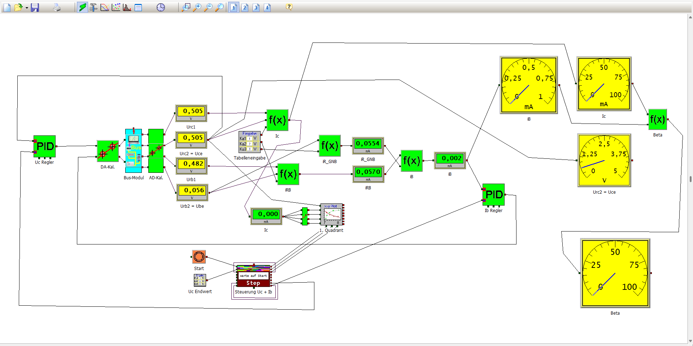{width=100%}

## 3.3 Was die Auflösung begrenzt

Die kleinste Änderung, die der Messplatz überhaupt darstellen kann, folgt aus den beiden
Umrechnungen aus Abschnitt 2. Beim Basisstrom gehen **zwei** gemessene Spannungen ein,
und $U_{RB2}$ geht sogar zweimal ein — einmal in der Differenz über $R_B$ und einmal im
Ableitstrom. Man leitet Gleichung (I) partiell ab:

$$\frac{\partial I_B}{\partial U_{RB1}} = \frac{1}{R_B},\qquad
  \frac{\partial I_B}{\partial U_{RB2}} = -\left(\frac{1}{R_B} + \frac{1}{R_{B\_GND}}\right)$$

Beide Spannungen sind auf $k_{AD}$ genau bekannt, und ihre Rundungsfehler sind
voneinander unabhängig; also ist

$$\Delta I_B = k_{AD}\sqrt{\left(\frac{1}{R_B}\right)^2 + \left(\frac{1}{R_B}+\frac{1}{R_{B\_GND}}\right)^2}.$$

Mit $R_B = 7{,}5$ k$\Omega$ und $R_{B\_GND} = 1$ k$\Omega$:

$$\Delta I_B = 184{,}659\ \mu\text{V}\cdot\sqrt{(1{,}333\cdot10^{-4})^2 + (1{,}4667\cdot10^{-3})^2}
 = 184{,}659\ \mu\text{V}\cdot 1{,}4727\cdot10^{-3} = 272\ \text{nA}$$

Bei einem Basisstrom von 20 $\mu$A sind das **1,36 %**. Ohne den Ableitwiderstand — also
nur die Differenzmessung über $R_B$ — wären es $\sqrt2\,k_{AD}/R_B = 34{,}8$ nA, also
0,17 %: **der Ableitwiderstand kostet den Faktor 7,8 an Auflösung.** Er ist trotzdem
richtig, denn ohne ihn ist der Basisknoten bei gesperrtem Transistor undefiniert; aber er
gehört so groß gewählt, wie es die Stabilität gerade noch erlaubt. Die Browser-Seite
rechnet diese Zahl zu jeder Schiebereinstellung mit und zeigt beide Anteile getrennt.

Beim Stellweg ist die Rechnung einfacher: ein Schritt am Digital-Analog-Umsetzer ändert
$U_{RB1}$ um 188 $\mu$V, also den Basisstrom um $188\ \mu\text{V}/7500\ \Omega = 25$ nA.
Der Stellweg ist damit elfmal feiner als der Messweg. Das ist die richtige Reihenfolge —
umgekehrt könnte der Regler den Sollwert grundsätzlich nicht treffen —, hat aber eine
Folge, die man kennen muss: der Regler kann den letzten Rest nicht mehr wegregeln,
sondern pendelt innerhalb eines Zählschritts der Messung. Eine Regelabweichung unterhalb
von $\Delta I_B$ ist keine Leistung, sondern Zufall. Die Prüfung der Browser-Seite setzt
die Schranke deshalb in Zählschritten und nicht in Prozent.

Beim Stellbereich gibt es eine zweite Grenze, die bei der Aufnahme sichtbar wird. Der
Speisepunkt muss

$$U_{RC1} = U_{CE} + I_C R_C \;\le\; 12{,}10\ \text{V}$$

leisten — 12,10 V, nicht 12,32 V, weil der Messweg früher an seinen Anschlag kommt als
der Treiber (Abschnitt 2.3). Bei $R_C = 470\ \Omega$ und $I_B = 40\ \mu$A ist
$I_C \approx 10{,}8$ mA, also $I_C R_C = 5{,}1$ V, und über $U_{CE} = 7$ V hinaus ist
nichts mehr zu holen. Genau das zeigen die Bedienblätter als „Abweichungen aufgrund
fehlender Regelreserve": die Kennlinie bricht nicht ab, sie bleibt stehen. Abhilfe ist
ein kleineres $R_C$ — zum Preis der Stromauflösung.

## 3.4 Ablauf einer Kennlinienaufnahme

Die Ablaufsteuerung des ersten Quadranten arbeitet in vier Schritten:

1. Ein Basisstrom wird vorgegeben (beispielsweise in Stufen von 0,2 mA von 0,2 mA bis
   1 mA) und vom äußeren Kreis eingeregelt.
2. Die Kollektor-Emitter-Spannung wird vom inneren Kreis in Schritten von beispielsweise
   0,1 V hochgefahren. Bei geringen Änderungen darf die Schrittweite wachsen.
3. Nach dem Einschwingen beider Kreise — Sollwert und Istwert werden verglichen —
   wird der Kollektorstrom aus $(U_{RC1}-U_{RC2})/R_C$ gerechnet und der Punkt
   $(U_{CE}, I_C)$ abgelegt.
4. Abgebrochen wird, wenn alle vorgegebenen Basisstromkurven durchfahren sind und
   beim größten Basisstrom der letzte Wert von $U_{CE}$ erreicht ist.

Die anderen Quadranten entstehen aus denselben vier Schritten mit vertauschten Rollen
von Sollgröße und Laufgröße.

\newpage

# 4 Was der Messplatz liefert: vier Quadranten

Am Prüfling (npn-Leistungstransistor Tesla KU611 im Metallgehäuse) ergeben sich die vier
Kennfelder. Sie sind hier so gezeigt, wie das Gerät sie ausgibt.

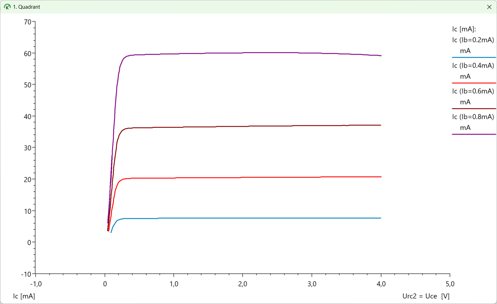{width=100%}

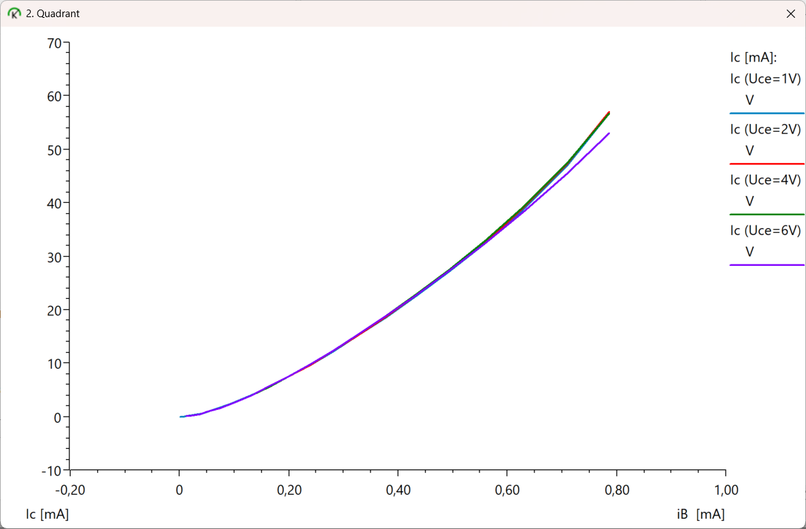{width=100%}

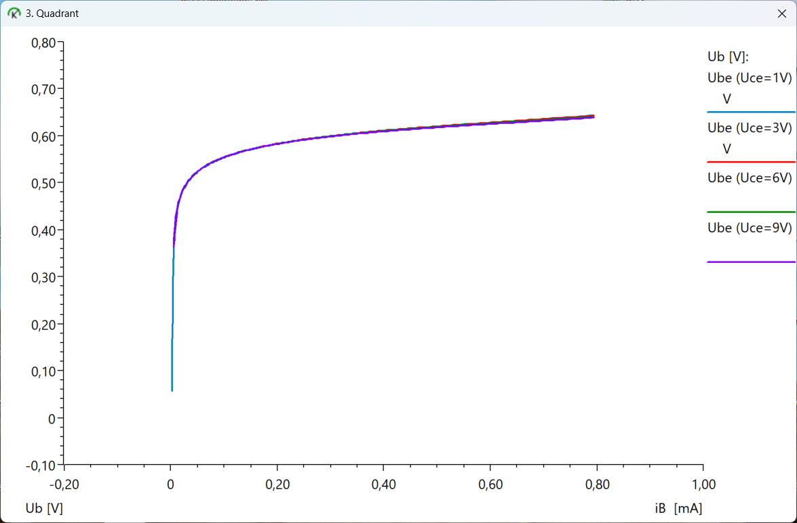{width=100%}

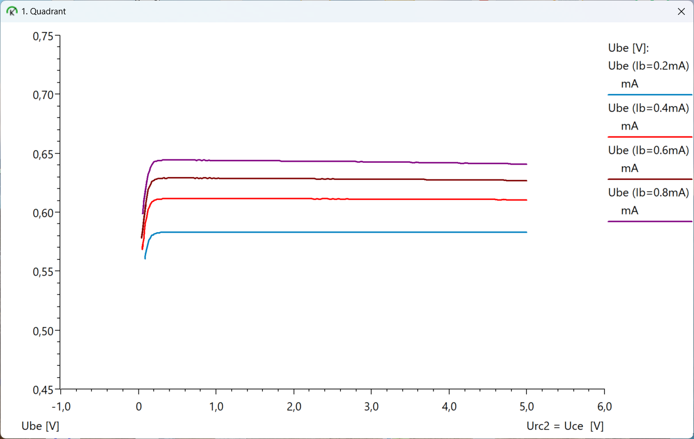{width=100%}

Für die Auswertung wurde ein zweiter Datensatz verwendet, der als Textdatei vorliegt
und einen Kleinsignaltransistor BC337-25 beschreibt: fünf Dateien mit den Feldern
`Ic/Vbe`, `Ic/Vce`, `Ic/Ib`, `hFE/Vce` und `hFE/Ic`, jeweils mit fünf Kurven und den
Spaltenköpfen `Trace:`, `Tag:`, `Colour:`. Der Grund für den Wechsel ist der
Messbereich: der Leistungstransistor arbeitet bei Basisströmen um 1 mA, der
Kleinsignaltransistor bei 8 … 40 $\mu$A, und für den Vergleich mit einem
Kleinsignalmodell ist der zweite Bereich der lehrreichere. Über die Herkunft der
Dateien ist im Arbeitsbereich nichts weiter hinterlegt als die Dateien selbst.

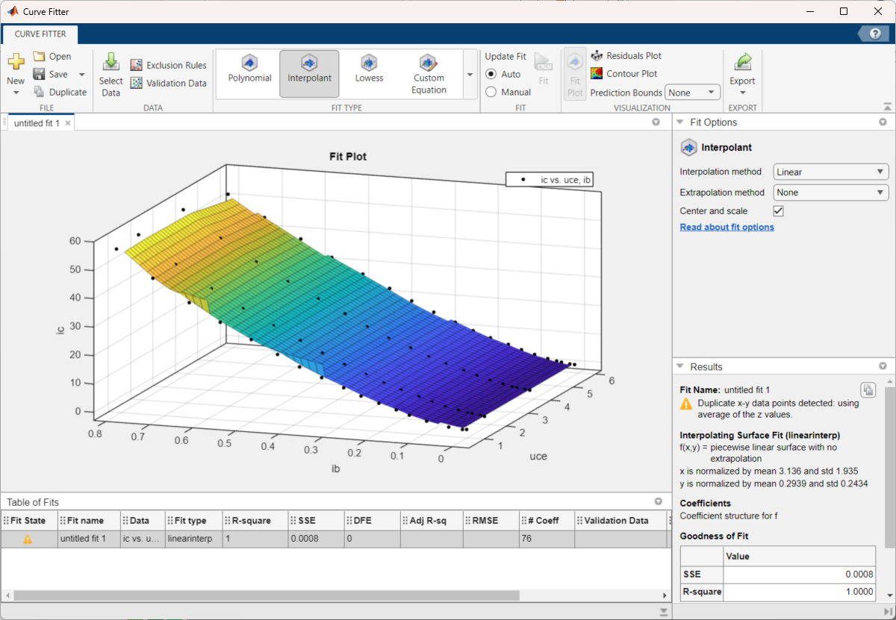{width=100%}

\newpage

# 5 Vom Kennfeld zum Modell

## 5.1 Die Modellgleichungen

Verwendet wird ein reduziertes Gummel-Poon-Modell mit vier Gleichungen. Es ist bewusst
klein gehalten: jede Gleichung beschreibt genau einen im Kennfeld sichtbaren Effekt,
und es kommt kein Parameter vor, der sich nicht an einer Stelle des Kennfelds ablesen
ließe. Mit der Temperaturspannung $V_T = 25{,}852$ mV (T = 300 K):

**(1) Der Kollektorstrom (Shockley mit Early-Faktor)**

$$I_C(U_{BE}, U_{CE}) = I_S \cdot \exp\!\left(\frac{U_{BE}}{n\,V_T}\right)\cdot\left(1 + \frac{U_{CE}}{V_A}\right)$$

Der erste Faktor ist die Diodengleichung des Basis-Emitter-Übergangs, der zweite die
Basisweitenmodulation: die Ausgangskennlinie steigt im aktiven Bereich linear an und
schneidet die verlängerte Achse bei $-V_A$.

**(2) Die stromabhängige Stromverstärkung**

$$\beta_{\mathrm{eff}}(I_C) = \frac{\beta_F}{\sqrt{1 + I_C/I_{KF}}}$$

Das ist die Hochstrominjektion: bei großen Strömen fällt die Stromverstärkung ab.

**(3) Der Basisstrom mit Bahnwiderstand**

$$I_B = \frac{I_S}{\beta_{\mathrm{eff}}}\cdot\exp\!\left(\frac{U_{BE} - I_B R_{BB}}{n\,V_T}\right)\cdot\left(1 + \frac{U_{CE}}{V_{AB}}\right)$$

$R_{BB}$ ist der Bahnwiderstand der Basiszuleitung: bei großem Basisstrom liegt nicht
die volle Klemmenspannung am Übergang. Die Gleichung ist implizit — $I_B$ steht auf
beiden Seiten — und wird durch Einsetzen gelöst (Abschnitt 5.6).

**(4) Die Umkehrung** ($U_{BE}$ aus vorgegebenem $I_C$):

$$U_{BE} = n\,V_T \cdot \ln\!\left(\frac{I_C}{I_S\left(1 + U_{CE}/V_A\right)}\right)$$

Das ist Gleichung (1) nach $U_{BE}$ aufgelöst und wird überall dort gebraucht, wo ein
Arbeitspunkt über den Kollektorstrom vorgegeben ist.

Sieben Parameter treten auf: $n$, $I_S$, $\beta_F$, $V_A$, $I_{KF}$, $R_{BB}$, $V_{AB}$.

## 5.2 Erster Weg: merkmalsweise Ablesung

Der erste Weg braucht keinen Rechner, nur Logarithmenpapier und ein Lineal. Er
bestimmt vier der sieben Parameter unmittelbar aus je einem Merkmal des Kennfelds.

**$n$ und $I_S$ aus der Gummel-Kurve.** Logarithmiert man Gleichung (1),

$$\ln I_C = \ln\!\left[I_S\left(1+\frac{U_{CE}}{V_A}\right)\right] + \frac{U_{BE}}{n V_T},$$

so ist $\ln I_C$ über $U_{BE}$ eine Gerade. Aus ihrer Steigung $m$ folgt

$$n = \frac{1}{m\,V_T},$$

aus dem Achsenabschnitt $I_S$. An den vier brauchbaren Kurven des Datensatzes ergaben
sich $n = 0{,}993$; $0{,}999$; $0{,}989$; $1{,}036$, also **$n = 1{,}004$** im Mittel,
und $I_S$ zwischen $3{,}3\cdot10^{-14}$ A und $9{,}6\cdot10^{-14}$ A, im Mittel
$5{,}26\cdot10^{-14}$ A.

**$V_A$ aus der Ausgangskennlinie.** Die Gerade im aktiven Bereich verlängert man nach
links; ihr Schnittpunkt mit der $U_{CE}$-Achse liegt bei $-V_A$. Aus den fünf
Basisstromkurven: 107,3 V; 123,8 V; 137,1 V; 158,1 V; 203,9 V — Mittel **146,0 V**.
Die große Streuung ist keine Schlamperei, sondern die Aussage selbst: der Early-Effekt
ist bei diesem Bauteil schwach, und aus einer fast waagerechten Geraden lässt sich ein
weit entfernter Schnittpunkt nur ungenau bestimmen. Abschnitt 5.5 bestätigt das.

**$\beta_F$ aus der Stromsteuerkennlinie.** Die Steigung von $I_C$ über $I_B$ ergab je
nach $U_{CE}$ 263; 270; 276; 279 — Mittel **272**. Der größte gemessene Wert von $h_{FE}$
über alle Daten ist 275. Beide Wege stimmen auf 1 % überein.

**$I_{KF}$, $R_{BB}$, $V_{AB}$** lassen sich so nicht bestimmen: im gemessenen Bereich
bis 9,3 mA ist kein Hochstromabfall sichtbar, und die Daten sind bei konstantem
Basisstrom aufgenommen, so dass der Bahnwiderstand sich nicht abhebt. Das Ergebnis der
Ablesung ist an dieser Stelle also nicht eine Zahl, sondern die Schranke
$I_{KF} \gg 9$ mA.

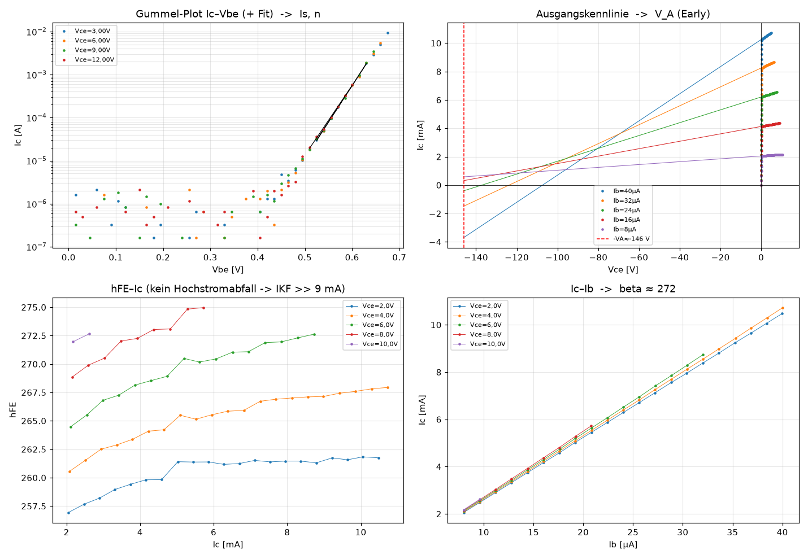{width=100%}

## 5.3 Zweiter Weg: Gesamtausgleich über alle Kurven

Der zweite Weg minimiert den Gesamtfehler aller fünf Kennfelder gleichzeitig. Als
Gütemaß dient der Mittelwert der datensatzweisen mittleren quadratischen Abweichung —
jeder Datensatz zählt gleich viel, damit nicht der mit den meisten Punkten das Ergebnis
allein bestimmt:

$$Q(\mathbf{p}) = \frac{1}{M}\sum_{j=1}^{M}\ \frac{1}{N_j}\sum_{i=1}^{N_j} r_{ji}(\mathbf{p})^2$$

Bei der Gummel-Kurve ist $r = \ln I_{C,\mathrm{Modell}} - \ln I_{C,\mathrm{Mess}}$
(weil dort der Strom über vier Zehnerpotenzen läuft), bei allen anderen Kennfeldern der
relative Fehler $r = (x_{\mathrm{Modell}} - x_{\mathrm{Mess}})/x_{\mathrm{Mess}}$.

Minimiert wird mit dem Simplexverfahren nach Nelder und Mead: ein Vielflach aus acht
Punkten im siebendimensionalen Parameterraum wird gespiegelt, gestreckt, gestaucht oder
zusammengezogen, bis es sich um das Minimum zusammenzieht. Es braucht keine
Ableitungen — richtig gewählt, weil zwei der Parameter ($I_{KF}$, $R_{BB}$) über
Zehnerpotenzen laufen und deshalb logarithmisch geführt werden.

Ergebnis (Startwerte aus Abschnitt 5.2):

| Parameter | Start | Gesamtausgleich |
|:--|--:|--:|
| $n$ | 1,004 | **1,004** |
| $I_S$ | $4{,}85\cdot10^{-14}$ A | **$4{,}765\cdot10^{-14}$ A** |
| $\beta_F$ | 272 | **253,2** |
| $V_A$ | 146,0 V | **126,6 V** |
| $V_{AB}$ | 200 V | 1390 V |
| $R_{BB}$ | 20 $\Omega$ | 18,8 $\Omega$ |
| $I_{KF}$ | 0,1 A | 4,05 A |

Der Fehler je Kennfeld sinkt dabei deutlich:

| Kennfeld | vorher | nachher |
|:--|--:|--:|
| Gummel $\ln I_C$ | 0,064 | 0,064 |
| Ausgangskennlinie | 2,658 % | **0,620 %** |
| $h_{FE}(U_{CE})$ | 3,001 % | **0,732 %** |
| $h_{FE}(I_C)$ | 2,554 % | **0,548 %** |
| $I_C(I_B)$ | 2,425 % | **0,579 %** |

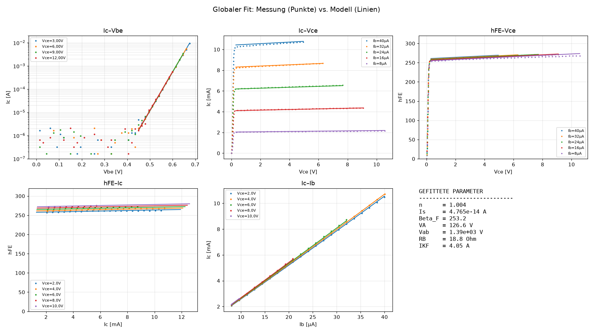{width=100%}

## 5.4 Dritter Weg: das erweiterte Modell

Nimmt man den Leckterm des Basisstroms hinzu (zwei weitere Parameter $I_{SE}$, $N_E$
für die Rekombination in der Sperrschicht) und hält $I_{KF}$, $R_{BB}$, $V_{AB}$ auf
Datenblattwerten fest, so bleiben vier freie Parameter. Das Ergebnis:
$n = 1{,}004$, $I_S = 4{,}726\cdot10^{-14}$ A, $\beta_F = 249{,}9$, $V_A = 103{,}3$ V,
$I_{SE} = 3{,}534\cdot10^{-15}$ A, $N_E = 1{,}350$.

Der Vergleich mit dem Datenblatt des BC337-25 fällt so aus:

| Parameter | Ausgleich | Datenblatt |
|:--|--:|--:|
| $I_S$ | $4{,}73\cdot10^{-14}$ A | $4{,}13\cdot10^{-14}$ A |
| $\beta_F$ | 250 | 292 |
| $V_A$ | 103 V | 146 V |

Die Abweichung bei $\beta_F$ ist keine Überraschung: der Buchstabe „25" im Typnamen
bezeichnet eine Auswahlgruppe mit einer Streubreite von etwa 160 bis 400. Das
vermessene Bauteil liegt in der Gruppe, nicht in deren Mitte.

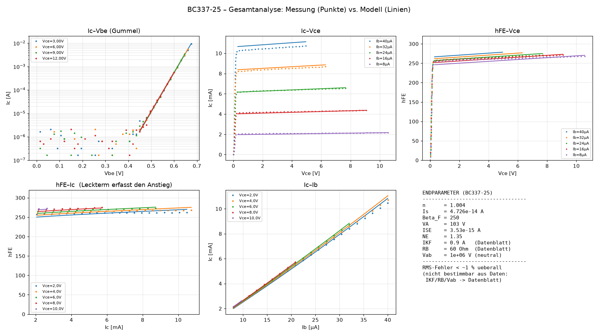{width=100%}

## 5.5 Was aus diesen Daten überhaupt bestimmbar ist

Ein angepasster Parameter ist nicht dasselbe wie ein bestimmter Parameter. Die Probe ist
einfach: man ändert einen Parameter um 20 % und sieht nach, um welchen Faktor das
Gütemaß $Q$ dabei wächst. Wächst es stark, ist der Parameter durch die Daten festgelegt;
bleibt es fast gleich, ist es eine flache Mulde, und jeder Wert darin ist gleich gut.

| Parameter | $Q$ wächst um den Faktor | Urteil |
|:--|--:|:--|
| $n$ | 3211,81 | gut bestimmt |
| $\beta_F$ | 38,50 | gut bestimmt |
| $I_S$ | 8,87 | gut bestimmt |
| $V_A$ | 1,06 | schwach |
| $R_{BB}$ | 1,01 | nicht bestimmbar |
| $V_{AB}$ | 1,00 | nicht bestimmbar |
| $I_{KF}$ | 1,00 | nicht bestimmbar |

Das ist das ehrlichste Ergebnis dieses Abschnitts. Drei der sieben Parameter sind aus
diesen Messungen nicht zu gewinnen — nicht weil das Verfahren schlecht wäre, sondern
weil die Messung den Bereich nicht berührt, in dem sie wirken: $I_{KF}$ wirkt erst bei
Strömen weit über 10 mA, $R_{BB}$ erst bei Basisströmen im Milliamperebereich, $V_{AB}$
überhaupt nur, wenn man die Rückwirkung auf den Basisstrom genau genug misst. Wer sie
braucht, muss andere Messungen fahren, nicht besser rechnen.

## 5.6 Wie die implizite Gleichung gelöst wird

Gleichung (3) hat $I_B$ auf beiden Seiten. Gelöst wird sie durch wiederholtes Einsetzen:
man beginnt mit $I_B^{(0)} = I_C/\beta_{\mathrm{eff}}$ (also ohne Bahnwiderstand) und
rechnet

$$I_B^{(k+1)} = \frac{I_S}{\beta_{\mathrm{eff}}}\cdot\exp\!\left(\frac{U_{BE} - I_B^{(k)} R_{BB}}{n V_T}\right)\cdot\left(1+\frac{U_{CE}}{V_{AB}}\right)$$

bis sich nichts mehr ändert. Das Verfahren zieht zusammen, solange
$|\partial I_B^{(k+1)}/\partial I_B^{(k)}| = I_B R_{BB}/(n V_T) < 1$ ist, also solange
der Spannungsabfall am Bahnwiderstand klein gegen die Temperaturspannung bleibt. Bei
$I_B = 20\ \mu$A und $R_{BB} = 18{,}8\ \Omega$ ist dieser Abfall 0,4 mV gegen 26 mV —
das Verfahren braucht dort drei bis vier Schritte.

Wird umgekehrt $U_{BE}$ zu einem vorgegebenen $I_B$ gesucht, hilft die Halbierung:
$I_B(U_{BE})$ wächst streng monoton, also genügt es, das Suchfenster $[0{,}2\ \text{V};
1{,}0\ \text{V}]$ 50-mal zu halbieren. Das ist langsamer als Newton, kann aber nicht
davonlaufen — bei einer Exponentialfunktion ein Vorzug.

## 5.7 Zwei Parametersätze und ihr Abstand

Im Projekt sind zwei Parametersätze in Gebrauch, und das ist Absicht: sie sind zwei
unabhängige Wege zum selben Ziel und zeigen, wie weit das Ergebnis trägt.

| | Arbeitssatz | Fitsatz |
|:--|--:|--:|
| Herkunft | erweitertes Modell (5.4) + $V_A$ aus Ablesung (5.2) | Gesamtausgleich (5.3) |
| $n$ | 1,004 | 1,004 |
| $I_S$ | $4{,}726\cdot10^{-14}$ A | $4{,}765\cdot10^{-14}$ A |
| $\beta_F$ | 249,9 | 253,2 |
| $V_A$ | 146,0 V | 126,6 V |
| $I_{KF}$ | 0,9 A | 4,05 A |
| $R_{BB}$ | 60 $\Omega$ | 18,8 $\Omega$ |
| $V_{AB}$ | $10^{6}$ V | 1390 V |

An denselben Messdaten gemessen (Programm `bjt_kennwerte.py`):

| Kennfeld | Arbeitssatz RMS / größte | Fitsatz RMS / größte |
|:--|--:|--:|
| $I_C(U_{CE})$, 146 Punkte | 2,510 % / 6,128 % | **0,621 % / 1,771 %** |
| $I_C(I_B)$, 69 Punkte | 2,093 % / 5,389 % | **0,573 % / 1,299 %** |
| $h_{FE}(U_{CE})$, 146 Punkte | 2,696 % / 6,058 % | **0,739 % / 2,216 %** |
| Gummel $\ln I_C$, 31 Punkte | 0,068 / 0,156 | **0,064 / 0,137** |

Der Fitsatz trifft die Messung viermal genauer. Für alles Folgende — Kleinsignal,
Vierpol, Browser-Seite — wird deshalb der Fitsatz verwendet und der Arbeitssatz als
Gegenprobe mitgeführt.

\newpage

# 6 Kleinsignal: die h-Parameter

## 6.1 Was ein h-Parameter ist

Im Arbeitspunkt wird die Kennfläche durch ihre Tangentialebene ersetzt. Als unabhängige
Größen wählt man in Emitterschaltung den Eingangsstrom $I_B$ und die Ausgangsspannung
$U_{CE}$; die abhängigen sind Eingangsspannung $U_{BE}$ und Ausgangsstrom $I_C$. Das
ergibt die Hybridform:

$$\begin{pmatrix} u_{BE} \\ i_C \end{pmatrix}
 = \begin{pmatrix} h_{11e} & h_{12e} \\ h_{21e} & h_{22e} \end{pmatrix}
   \begin{pmatrix} i_B \\ u_{CE} \end{pmatrix}$$

mit

$$h_{11e} = \left.\frac{\partial U_{BE}}{\partial I_B}\right|_{U_{CE}},\quad
  h_{12e} = \left.\frac{\partial U_{BE}}{\partial U_{CE}}\right|_{I_B},\quad
  h_{21e} = \left.\frac{\partial I_C}{\partial I_B}\right|_{U_{CE}},\quad
  h_{22e} = \left.\frac{\partial I_C}{\partial U_{CE}}\right|_{I_B}.$$

Jeder der vier ist die Steigung einer Tangente in genau einem der vier Quadranten. Das
ist der Grund, warum das Vierquadrantenbild so gezeichnet wird: es ist kein
Anschauungsbild, sondern die grafische Fassung dieser vier Ableitungen.

## 6.2 Herleitung aus dem Modell

Das Modell gibt nicht unmittelbar $U_{BE}(I_B)$, sondern $I_B(U_{BE}, U_{CE})$ und
$I_C(U_{BE}, U_{CE})$. Man bildet deshalb zuerst die vier Leitwerte

$$g_m = \frac{\partial I_C}{\partial U_{BE}},\quad
  g_o = \frac{\partial I_C}{\partial U_{CE}},\quad
  g_\pi = \frac{\partial I_B}{\partial U_{BE}},\quad
  g_\mu = \frac{\partial I_B}{\partial U_{CE}}$$

und rechnet daraus um. Aus $i_B = g_\pi u_{BE} + g_\mu u_{CE}$ folgt unmittelbar

$$u_{BE} = \frac{1}{g_\pi} i_B - \frac{g_\mu}{g_\pi} u_{CE}
\qquad\Longrightarrow\qquad
h_{11e} = \frac{1}{g_\pi},\qquad h_{12e} = -\frac{g_\mu}{g_\pi}.$$

Einsetzen in $i_C = g_m u_{BE} + g_o u_{CE}$ ergibt

$$i_C = \frac{g_m}{g_\pi} i_B + \left(g_o - \frac{g_m g_\mu}{g_\pi}\right) u_{CE}
\qquad\Longrightarrow\qquad
h_{21e} = \frac{g_m}{g_\pi},\qquad h_{22e} = g_o - \frac{g_m g_\mu}{g_\pi}.$$

Damit ist der Übergang vom Kennfeld zum Vierpol vollständig hergeleitet — ohne ein
Ersatzschaltbild vorauszusetzen. Die Leitwerte selbst werden als zentrale Differenzen
gerechnet, etwa

$$g_m \approx \frac{I_C(U_{BE}+\delta, U_{CE}) - I_C(U_{BE}-\delta, U_{CE})}{2\delta},
\qquad \delta = 0{,}1\ \text{mV},$$

weil Gleichung (3) implizit ist und sich nicht geschlossen ableiten lässt. Die
Schrittweite ist ein Kompromiss: zu groß, und die Krümmung fälscht das Ergebnis; zu
klein, und die Auslöschung gleicher Zahlen frisst die Stellen auf. Bei
$\delta = 0{,}1$ mV gegen $n V_T = 26$ mV liegt der Verfahrensfehler bei
$(\delta/nV_T)^2/6 \approx 2{,}5\cdot10^{-6}$ — vernachlässigbar.

Zur Gegenprobe von Hand: für den Kollektorstrom ist die Ableitung geschlossen bekannt,

$$g_m = \frac{\partial I_C}{\partial U_{BE}} = \frac{I_C}{n V_T}
      = \frac{5\ \text{mA}}{1{,}004 \cdot 25{,}852\ \text{mV}} = 192{,}6\ \text{mS},$$

und genau diesen Wert liefert auch die numerische Differenz.

## 6.3 Die Zahlen im Arbeitspunkt

Arbeitspunkt $I_C = 5{,}00$ mA, $U_{CE} = 5{,}00$ V. Aus Gleichung (4) folgt zuerst
$U_{BE}$, daraus über Gleichung (3) der Basisstrom:

| | Arbeitssatz | Fitsatz | Abstand |
|:--|--:|--:|--:|
| $U_{BE}$ | 658,0 mV | 657,7 mV | 0,05 % |
| $I_B$ | 18,58 $\mu$A | 18,82 $\mu$A | 1,3 % |
| $h_{11e}$ | 1452,7 $\Omega$ | 1397,2 $\Omega$ | 3,8 % |
| $h_{21e}$ | 279,8 | 269,1 | 3,8 % |
| $h_{22e}$ | 33,02 $\mu$S | 34,39 $\mu$S | 4,2 % |
| $h_{12e}$ | $-4{,}99\cdot10^{-7}$ | $-1{,}87\cdot10^{-5}$ | — |
| $g_m$ | 192,64 mS | 192,64 mS | 0 |

Drei Beobachtungen:

* Die Steilheit $g_m$ ist in beiden Sätzen identisch, weil sie nach 6.2 nur von $I_C$
  und $n$ abhängt — und $n$ ist der am besten bestimmte Parameter überhaupt.
* $h_{11e}, h_{21e}, h_{22e}$ unterscheiden sich um weniger als 5 %, obwohl die
  zugrunde liegenden Parametersätze sich in $V_A$ um 15 % und in $R_{BB}$ um den
  Faktor 3 unterscheiden. Das ist die eigentliche Aussage von Abschnitt 5.5: die nicht
  bestimmbaren Parameter sind deshalb nicht bestimmbar, weil sie im Ergebnis fast nichts
  ändern.
* $h_{12e}$ ist im Arbeitssatz um anderthalb Zehnerpotenzen kleiner, weil dort
  $V_{AB} = 10^6$ V gesetzt ist — das heißt „keine Rückwirkung". Beide Werte sind so
  klein, dass sie in jeder Verstärkerrechnung verschwinden; $h_{12e} \cdot u_{CE}$
  liegt bei 1 V Ausgangshub unter 20 $\mu$V.

Die Probe „$h_{21e} \approx \beta_F$" geht auf: 269 gegen 253 beim Fitsatz. Die
Differenz ist kein Fehler, sondern der Unterschied zwischen Gleichstromverstärkung
($I_C/I_B$) und Wechselstromverstärkung ($\partial I_C/\partial I_B$); letztere ist
größer, solange $h_{FE}$ mit dem Strom noch steigt.

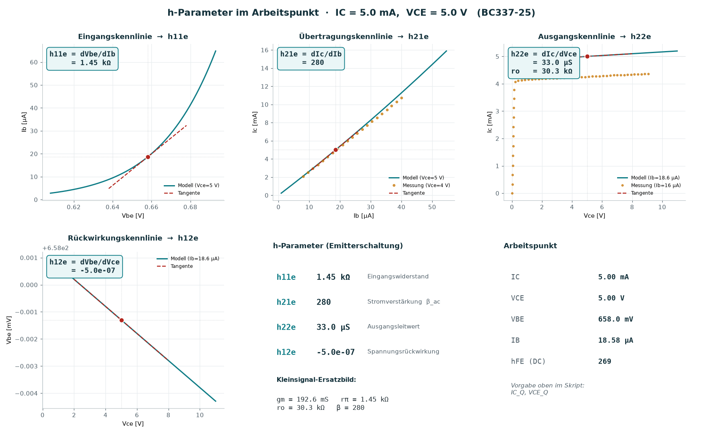{width=100%}

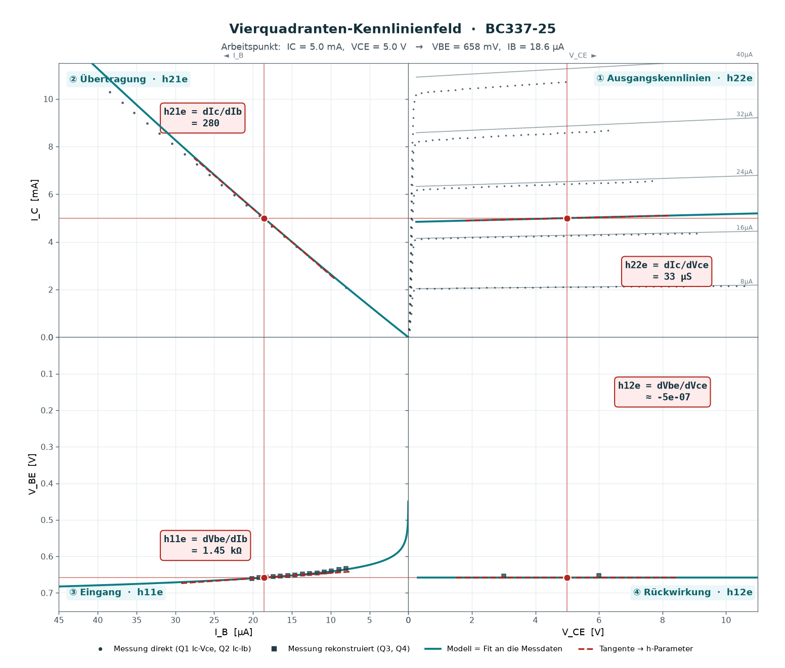{width=100%}

\newpage

# 7 Vom h-Vierpol zur Kettenmatrix

## 7.1 Warum A-Parameter

Die Hybridform ist zum Messen bequem, zum Zusammensetzen aber unbrauchbar: schaltet man
zwei Vierpole hintereinander, so lassen sich ihre h-Matrizen nicht einfach
multiplizieren. Die Kettenform kann das. Sie beschreibt Eingang durch Ausgang:

$$\begin{pmatrix} u_1 \\ i_1 \end{pmatrix}
 = \mathbf{A}\begin{pmatrix} u_2 \\ -i_2 \end{pmatrix},
\qquad
\mathbf{A} = \begin{pmatrix} A_{11} & A_{12} \\ A_{21} & A_{22} \end{pmatrix}$$

und für eine Kette gilt schlicht $\mathbf{A}_{\mathrm{ges}} = \mathbf{A}_1\mathbf{A}_2\cdots$.

## 7.2 Die Umrechnung h $\rightarrow$ A

Mit $\Delta_h = h_{11}h_{22} - h_{12}h_{21}$ lautet sie

$$\mathbf{A} = \frac{1}{h_{21}}\begin{pmatrix} -\Delta_h & -h_{11} \\ -h_{22} & -1 \end{pmatrix}.$$

Herleitung in zwei Zeilen: die zweite Hybridzeile $i_2 = h_{21}i_1 + h_{22}u_2$ nach
$i_1$ aufgelöst gibt $i_1 = (i_2 - h_{22}u_2)/h_{21}$; das in die erste Zeile
$u_1 = h_{11}i_1 + h_{12}u_2$ eingesetzt gibt
$u_1 = (h_{11}/h_{21})i_2 + (h_{12} - h_{11}h_{22}/h_{21})u_2$. Mit dem
Vorzeichenwechsel des Kettenzählpfeils ($-i_2$ statt $i_2$) steht die Matrix da.

## 7.3 Querwiderstände

Ein Widerstand, der quer vom Signalweg gegen Masse liegt (der Basiswiderstand gegen die
Betriebsspannung ist für das Kleinsignal dasselbe, weil die Betriebsspannung
Wechselstrommasse ist), hat die Kettenmatrix

$$\mathbf{A}_R = \begin{pmatrix} 1 & 0 \\ 1/R & 1 \end{pmatrix},$$

denn er lässt die Spannung durch ($u_1 = u_2$) und zweigt den Strom $u_2/R$ ab.

## 7.4 Die Emitterschaltung, durchgerechnet

Schaltung: $U_{CC} = 15$ V, $R_C = 1$ k$\Omega$, Basisvorwiderstand $R_B$ von $U_{CC}$
zur Basis, Last $R_L = 10$ k$\Omega$, Quellwiderstand $R_i = 1$ k$\Omega$.

**Schritt 1 — Arbeitspunkt.** Zwei Maschen, zwei Unbekannte ($U_{BE}$, $U_{CE}$), und
rechts stehen die Modellgleichungen:

$$f_1 = \frac{U_{CC}-U_{BE}}{R_B} - I_B(U_{BE},U_{CE}) = 0$$
$$f_2 = \frac{U_{CC}-U_{CE}}{R_C} - I_C(U_{BE},U_{CE}) = 0$$

Gelöst wird mit Newton-Raphson. Die Jacobi-Matrix wird numerisch gebildet (das Modell
ist implizit), die Schrittweite wird begrenzt — $|\Delta U_{BE}| \le 50$ mV,
$|\Delta U_{CE}| \le 2$ V — weil eine Exponentialfunktion einen ungebremsten
Newton-Schritt sonst über alle Zahlgrenzen trägt. Als Rückfallebene dient eine
verschachtelte Halbierung.

Der Basiswiderstand wurde so gewählt, dass $U_{CE} = U_{CC}/2$ herauskäme: exakt
532,1 k$\Omega$, nächster Wert der Reihe E24 **510 k$\Omega$**. Mit diesem
Reihenwert liegt der Arbeitspunkt nach 6 Newton-Schritten bei

| | Arbeitssatz | Fitsatz |
|:--|--:|--:|
| $U_{BE}$ | 669,3 mV | 668,2 mV |
| $I_B$ | 28,10 $\mu$A | 28,10 $\mu$A |
| $U_{CE}$ | 7,17 V | 7,36 V |
| $I_C$ | 7,83 mA | 7,64 mA |
| $h_{FE} = I_C/I_B$ | 279 | 272 |

Dass $U_{CE}$ nicht genau 7,5 V wird, ist die Folge des E24-Sprungs von 532 auf
510 k$\Omega$: 4 % mehr Basisstrom, 4 % mehr Kollektorstrom, 0,3 V weniger $U_{CE}$.

**Schritt 2 — h-Parameter in diesem Arbeitspunkt** (nicht im Arbeitspunkt aus
Abschnitt 6.3 — Kleinsignalparameter gelten nur dort, wo sie gerechnet wurden). Fitsatz:
$h_{11e} = 941{,}5\ \Omega$, $h_{12e} = -1{,}874\cdot10^{-5}$, $h_{21e} = 277{,}0$,
$h_{22e} = 51{,}49\ \mu$S, $\Delta_h = 0{,}05367$.

**Schritt 3 — Kettenmatrizen.** Der Transistor:

$$\mathbf{A}_T = \begin{pmatrix} -1{,}93749\cdot10^{-4} & -3{,}39893 \\ -1{,}85876\cdot10^{-7} & -3{,}60997\cdot10^{-3}\end{pmatrix}$$

dazu die beiden Querwiderstände mit $1/R_B = 1{,}961\ \mu$S und $1/R_C = 1{,}000$ mS.

**Schritt 4 — Kette.** In Signalrichtung:

$$\mathbf{A}_{\mathrm{ges}} = \mathbf{A}_{R_B}\,\mathbf{A}_T\,\mathbf{A}_{R_C}
= \begin{pmatrix} -3{,}59268\cdot10^{-3} & -3{,}39893 \\ -3{,}80289\cdot10^{-6} & -3{,}61664\cdot10^{-3}\end{pmatrix}$$

**Schritt 5 — Beschaltung.** Aus den A-Parametern folgen die Kennwerte der
beschalteten Stufe unmittelbar:

$$r_{\mathrm{ein}} = \frac{A_{11}R_L + A_{12}}{A_{21}R_L + A_{22}},\qquad
  r_{\mathrm{aus}} = \frac{A_{22}R_i + A_{12}}{A_{21}R_i + A_{11}},$$
$$A_v = \frac{u_2}{u_1} = \frac{R_L}{A_{11}R_L + A_{12}},\qquad
  A_i = \frac{1}{A_{21}R_L + A_{22}},\qquad
  A_{vs} = A_v\cdot\frac{r_{\mathrm{ein}}}{r_{\mathrm{ein}}+R_i}.$$

| Kennwert | Arbeitssatz | Fitsatz |
|:--|--:|--:|
| $r_{\mathrm{ein}}$ | 978 $\Omega$ | 944 $\Omega$ |
| $r_{\mathrm{aus}}$ | 951 $\Omega$ | 949 $\Omega$ |
| $A_v$ | $-262{,}0$ (48,4 dB) | $-254{,}3$ (48,1 dB) |
| $A_i$ | $-25{,}6$ | $-24{,}0$ |
| $A_{vs}$ | $-129{,}5$ (42,2 dB) | $-123{,}5$ (41,8 dB) |

Die Gegenprobe von Hand: die Spannungsverstärkung einer Emitterschaltung ist
$A_v \approx -g_m (R_C \parallel R_L \parallel r_o)$. Mit
$g_m = I_C/(nV_T) = 7{,}64\ \text{mA}/25{,}95\ \text{mV} = 294$ mS,
$R_C \parallel R_L = 909\ \Omega$ und $r_o = 1/h_{22e} = 19{,}4$ k$\Omega$ ergibt sich
$909 \parallel 19421 = 868\ \Omega$ und $A_v \approx -255{,}6$. Zwischen Handformel und
Kettenrechnung liegen damit 0,5 % — das ist der Anteil, den der Basiswiderstand und die
Rückwirkung beitragen und den die Handformel weglässt.

$r_{\mathrm{aus}} \approx R_C \parallel r_o = 1000 \parallel 19400 = 951\ \Omega$ —
auch das stimmt. $r_{\mathrm{ein}} \approx h_{11e} \parallel R_B = 941{,}5 \parallel 510000
= 939{,}7\ \Omega$; die Kettenrechnung sagt 944 $\Omega$, der Rest ist die Rückwirkung über
$h_{12e}$.

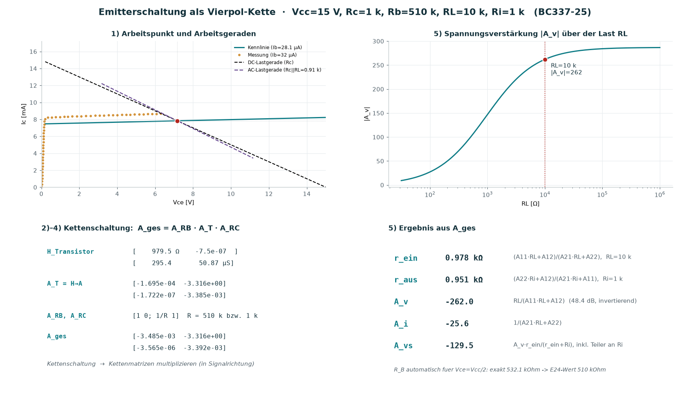{width=100%}

\newpage

# 8 Der Transistor als Vierpol — die Klammer

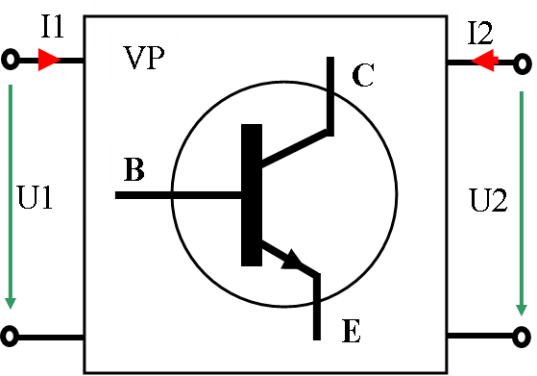{width=55%}

Der Bogen dieses Manuskripts lässt sich in einem Satz sagen: der Messplatz stellt zwei
Größen ein und misst zwei, das Modell verbindet die vier durch Gleichungen, und die
Ableitungen dieser Gleichungen im Arbeitspunkt sind die Vierpolparameter. Jede Stufe
prüft die vorige:

| Stufe | Zweiter, unabhängiger Weg |
|:--|:--|
| Umrechnung Register $\rightarrow$ Volt | Bauteilwerte der Schaltpläne gegen die Angaben im Übersichtsplan (12,32 V / 12,10 V gegen „0 … 12 V") |
| Steckwiderstände | Rückrechnung aus drei Bedienblättern, Streuung 0,4 % |
| Modellparameter | merkmalsweise Ablesung gegen Gesamtausgleich gegen erweitertes Modell |
| Bestimmbarkeit | Empfindlichkeit des Gütemaßes statt Behauptung |
| h-Parameter | numerische Differenz gegen die geschlossene Formel $g_m = I_C/(nV_T)$ |
| Verstärkerkennwerte | Kettenmatrix gegen die Handformel $A_v \approx -g_m(R_C \parallel R_L \parallel r_o)$ |
| Ganze Kette | zwei Parametersätze, Abstand im Ergebnis unter 5 % |

\newpage

# 9 Beiliegende Programme

| Datei | Was sie tut |
|:--|:--|
| `bjt_extract.py` | merkmalsweise Ablesung (Abschnitt 5.2) |
| `bjt_fit.py` | Gesamtausgleich über alle Kennfelder, Bestimmbarkeit (5.3, 5.5) |
| `bjt_gesamt.py` | erweitertes Modell mit Leckterm, Datenblattvergleich (5.4) |
| `bjt_analyse.py`, `bjt_verify.py`, `bjt_modell_vergleich.py` | Zwischenschritte und Gegenproben |
| `bjt_dashboard.py` | alle Kennfelder und Parameter auf einem Blatt |
| `bjt_hparam.py` | h-Parameter im Arbeitspunkt mit Tangentenbild (Abschnitt 6) |
| `bjt_4quadrant.py` | Vierquadranten-Kennfeld mit durchgezogenem Arbeitspunkt |
| `bjt_verstaerker.py` | Emitterschaltung: Newton-Arbeitspunkt, Kettenmatrix (Abschnitt 7) |
| `bjt_kennwerte.py` | vergleicht beide Parametersätze an denselben Daten und schreibt alle Zahlen dieses Manuskripts nach `kennwerte.json` |
| `geraetekonstanten.py` | rechnet die Umrechnungen aus Abschnitt 2 aus den Bauteilwerten und schreibt sie nach `geraet.json` |
| `Kennlinien-Schreiber.ino`, `ad_da.cpp`, `modbus.cpp`, `config.h` | die Firmware des Messplatzes |

Alle Auswerteprogramme brauchen nur `numpy` und `matplotlib` und laufen im Ordner der
Messdateien.

\newpage

# 10 Was offen ist

1. **$R_C$ ist nicht dokumentiert.** Der Wert lässt sich aus den vorliegenden Blättern
   nicht zurückrechnen (Abschnitt 2.5). Die Browser-Seite führt ihn deshalb als
   Eingabe; wer das Gerät in der Hand hat, sollte ihn nachtragen.
2. **Die Messdatei-Herkunft.** Die fünf Textdateien des BC337-25 tragen keine
   Geräteangabe. Für die Auswertung ist das gleichgültig, für die Nachvollziehbarkeit
   nicht.
3. **Die Regelparameter.** Die beiden Regler des Bedienblatts sind als PID-Blöcke
   ausgeführt; ihre Beiwerte liegen im Projekt des Leitstands und nicht im
   Arbeitsbereich. Die Browser-Seite bildet die Kaskade deshalb mit einem einfachen
   Integralregler nach und weist das aus.
4. **Der vierte Quadrant am Leistungstransistor.** Die Rückwirkung ist so klein, dass
   sie im vorliegenden Blatt nahe an der Auflösungsgrenze des Messwegs liegt
   (Abschnitt 3.3). Eine Messung mit größerem $R_C$ und kleinerem Bereich wäre
   aussagekräftiger.
